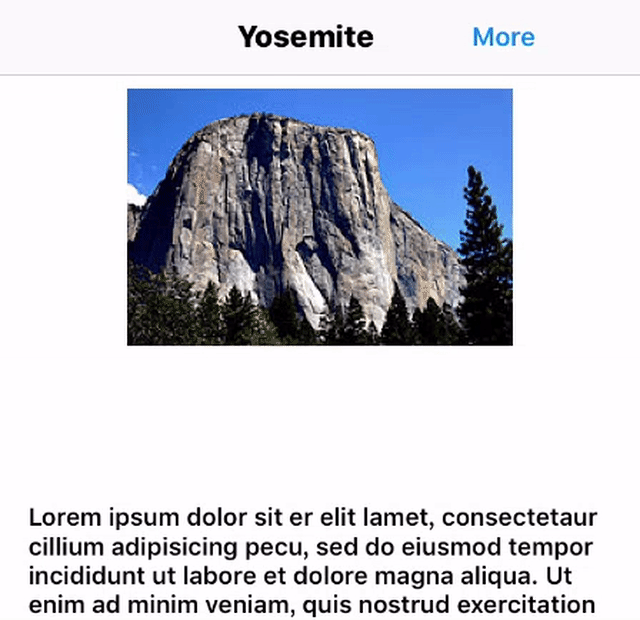

#CYMenu





A spring animate menu for iOS.

##Requirements

iOS 8.x / 9.x

##Installation

Add CYMenu.swift to your project.

##Usage
1.Create a CYMenu instance.

```swift
	self.menu = CYMenu(self.menu = CYMenu(NumberOfItems: 3, ItemSize: 50, ItemSpace: 15, OriginPoint: CGPointMake(moreButton.center.x , moreButton.center.y + 10 ) ,ShowDirection: .Down))
```

2.Add icons and titles.

```swift
self.menu!.menuTitles = ["Like" , "Share" , "Save"]
self.menu.menuIcons = ["Like" , "Share" , "Save"]
```

3.Set handle block

```swift
 self.menu!.callBackWithIndex = {index in
            print(index)
        }
```

##License
This project is under MIT License
